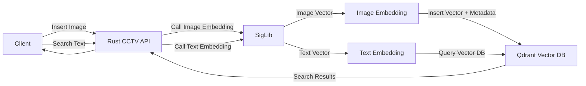

# Rust CCTV Search Backend

A high-performance, production-ready backend service for searching CCTV footage using vector embeddings and Qdrant vector database. Built with clean architecture principles for maximum maintainability and performance.

## Features

- **🔍 Image Search**: Search for CCTV images using natural language queries
- **📅 Datetime Filtering**: Filter search results by date and time ranges
- **🌐 URL Support**: Works with both local filenames and image URLs
- **🤖 Automated Image Fetching**: Background scheduler that automatically fetches and indexes images from CCTV metadata API every 10 minutes
- **⚡ High Performance**: Optimized with inline functions and efficient payload building
- **🏗️ Clean Architecture**: Modular design with clear separation of concerns

## Software Architecture



## Project Structure

```
rust-cctv/
├── src/
│   ├── config.rs                   # Centralized configuration management
│   ├── main.rs                     # Application entry point (~80 lines)
│   ├── scheduler.rs                # Background task scheduler
│   ├── handlers.rs                 # HTTP request handlers
│   ├── models/
│   │   ├── mod.rs
│   │   └── search.rs               # Data models & request/response types
│   └── services/
│       ├── mod.rs                  # Service module exports
│       ├── ai_service.rs           # AI embedding service integration
│       ├── cctv_api.rs             # CCTV metadata API client
│       ├── qdrant_service.rs       # Qdrant vector DB operations
│       ├── filename_utils.rs       # Datetime conversion utilities
│       └── payload_builder.rs      # Fluent API for building Qdrant payloads
├── Cargo.toml
├── .env                            # Environment configuration
├── README.md
└── REFACTORING_SUMMARY.md          # Detailed refactoring documentation
```

## Recent Improvements (v2.0)

✨ **Major refactoring for better code quality:**
- 📉 Reduced main.rs from 326 to ~80 lines (75% reduction)
- 🏗️ Extracted scheduler logic into dedicated module
- 🛠️ Created fluent PayloadBuilder API (70% less boilerplate)
- 🎯 Centralized configuration management
- ⚡ Added performance optimizations with `#[inline]` attributes
- 🧹 Removed all dead code and unused functions

See [REFACTORING_SUMMARY.md](REFACTORING_SUMMARY.md) for detailed changes.

## Installation

1. Clone the repository
2. Install dependencies
   ```bash
   cargo build
   ```
3. Set up environment variables (see Configuration)
4. Run the service
   ```bash
   cargo run
   ```
   
   The application will automatically:
   - Create the collection if it doesn't exist
   - Set up a datetime field index for filtering
   - Start the background scheduler for automated image fetching

## Docker Deployment

The application includes Docker support with multi-stage builds for optimal image size and security.

### Quick Start with Docker Compose

1. **Copy the environment template**:
   ```bash
   cp .env.example .env
   ```

2. **Edit `.env` and set your credentials**:
   ```bash
   # Required: Set your CCTV API authentication token
   CCTV_AUTH_TOKEN=your_actual_token_here
   ```

3. **Start all services**:
   ```bash
   docker-compose up -d
   ```

This will start:
- **Rust Backend API** on port `8080`
- **Qdrant Vector Database** on ports `6333` (REST) and `6334` (gRPC)

### Environment Variables in Docker

The `docker-compose.yml` is pre-configured with all necessary environment variables:

```yaml
environment:
  # Qdrant Configuration
  - QDRANT_URL=http://qdrant:6334
  - QDRANT_API_KEY=my-secret-api-key
  - COLLECTION_NAME=nt-cctv-vehicles
  
  # AI Service Configuration
  - AI_SERVICE_URL=http://host.docker.internal:5090
  
  # CCTV API Configuration
  - CCTV_API_URL=https://ntvideo.totbb.net/video-metadata/train-data-condition
  - CCTV_AUTH_TOKEN=${CCTV_AUTH_TOKEN}  # Loaded from .env file
  - CCTV_ID=cctv01
```

### Connecting to Host Services

If your **AI Service** runs on your host machine (not in Docker):

- **Windows/Mac**: Use `host.docker.internal:5090` (already configured)
- **Linux**: Change to `172.17.0.1:5090` in `docker-compose.yml`:
  ```yaml
  - AI_SERVICE_URL=http://172.17.0.1:5090
  ```

### Docker Commands

```bash
# Start services
docker-compose up -d

# View logs
docker-compose logs -f backend

# Stop services
docker-compose down

# Rebuild after code changes
docker-compose up -d --build

# Remove all data (including Qdrant storage)
docker-compose down -v
```

### Dockerfile Details

The Dockerfile uses a **multi-stage build**:

1. **Builder Stage**: 
   - Uses `rust:1.91-slim-bookworm`
   - Compiles with musl for static linking
   - Optimized with release flags and stripped debug symbols

2. **Runtime Stage**:
   - Uses `scratch` (minimal base image)
   - Only contains the compiled binary
   - Final image size: ~15-20MB

### Production Deployment

For production, consider:

1. **Change default API keys** in `docker-compose.yml`:
   ```yaml
   - QDRANT_API_KEY=your_secure_random_key_here
   ```

2. **Use Docker secrets** for sensitive data:
   ```yaml
   secrets:
     - cctv_auth_token
   ```

3. **Add resource limits**:
   ```yaml
   deploy:
     resources:
       limits:
         cpus: '1'
         memory: 512M
   ```

4. **Enable health checks**:
   ```yaml
   healthcheck:
     test: ["CMD", "curl", "-f", "http://localhost:8080/health"]
     interval: 30s
     timeout: 10s
     retries: 3
   ```

## Configuration

Configure the application using environment variables in `.env`:

### Required
- `CCTV_AUTH_TOKEN`: Bearer token for CCTV metadata API authentication **(required)**

### Optional (with defaults)

#### Database
- `QDRANT_URL`: URL of the Qdrant vector database (default: `http://localhost:6334`)
- `QDRANT_API_KEY`: API key for Qdrant (default: `your_api_key_here`)
- `COLLECTION_NAME`: Name of the Qdrant collection (default: `nt-cctv-vehicles`)

#### AI Service
- `AI_SERVICE_URL`: URL of the AI embedding service (default: `http://localhost:5090`)

#### CCTV API
- `CCTV_API_URL`: URL of the CCTV metadata API (default: `https://ntvideo.totbb.net/video-metadata/train-data-condition`)
- `CCTV_ID`: CCTV camera ID to fetch images from (default: `cctv01`)

#### Server
- `SERVER_PORT`: HTTP server port (default: `8080`)

#### Scheduler
- `FETCH_LIMIT`: Maximum images to fetch per request (default: `20`)
- `FETCH_DAYS_RANGE`: Days to look back for images (default: `2`)
- `FETCH_EVERY_TIME`: Fetch interval in minutes (default: `10`)

### Example `.env` file
```bash
# === Required Configuration ===
CCTV_AUTH_TOKEN=your_bearer_token_here

# === Database Configuration ===
QDRANT_URL=http://localhost:6334
QDRANT_API_KEY=your_qdrant_api_key
COLLECTION_NAME=nt-cctv-vehicles

# === AI Service Configuration ===
AI_SERVICE_URL=http://localhost:5090

# === CCTV API Configuration ===
CCTV_API_URL=https://ntvideo.totbb.net/video-metadata/train-data-condition
CCTV_ID=cctv01

# === Server Configuration ===
SERVER_PORT=8080

# === Scheduler Configuration ===
FETCH_LIMIT=20
FETCH_DAYS_RANGE=2
FETCH_EVERY_TIME=10
```

## Collection and Index Setup

The application automatically handles:
1. **Collection Creation**: Creates the collection with 768-dimensional vectors and cosine distance if it doesn't exist
2. **Datetime Index**: Creates a datetime field index to enable filtering by date and time ranges

No manual setup required! 🎉

## Automated Image Fetching

The application includes a background scheduler that automatically fetches and indexes CCTV images from the metadata API. This feature runs independently from the web server.

### How It Works

1. **Scheduler**: Runs every N minutes (configurable via `FETCH_EVERY_TIME` env var, default: 10)
2. **Fetch Limit**: Fetches up to N images per run (configurable via `FETCH_LIMIT` env var, default: 20)
3. **Date Range**: Queries images from the last N days (configurable via `FETCH_DAYS_RANGE` env var, default: 2)
4. **Processing**: For each fetched image:
   - Downloads the image metadata from the CCTV API
   - Generates vector embeddings via the AI service
   - Stores the embedding and metadata in Qdrant with deterministic IDs

### Logs

The scheduler provides detailed logging:
```
⏰ Running scheduled CCTV image fetch...
📡 Fetching CCTV training data from API...
   -> CCTV ID: cctv01
   -> Date Range: 2025-12-17 08:00:00 to 2025-12-19 20:00:00
   -> Limit: 20
✅ Successfully fetched 20 images from CCTV API
📥 Processing 20 images...
   [1/20] Processing: image1.jpg
      ✅ Inserted successfully
...
✅ Scheduled task completed
```

### Configuration

All scheduler settings are now configurable via environment variables:

```bash
# In your .env file:
FETCH_LIMIT=20        # Images per fetch
FETCH_DAYS_RANGE=2    # Days to look back
FETCH_EVERY_TIME=10   # Minutes between runs
```

## API Endpoints

### Insert Image

Insert a new CCTV image with metadata. The endpoint now accepts the full `CctvImageData` format for seamless integration with the CCTV API.

**Endpoint**: `POST /insert_image`

**Request Body**:
```json
{
  "id": 12345,
  "cctv_id": "cctv01",
  "date": "2025-10-08",
  "time": "06:32:00",
  "frame": 123,
  "vehicle_type": 2,
  "yolo_id": 5,
  "filename": "cctv01_2025-10-08_06-32_123.jpg",
  "file_path": "https://example.com/images/cctv01_2025-10-08_06-32_123.jpg",
  "ai_label": {
    "class_name": "sedan",
    "confidence": 0.95
  },
  "createdAt": "2025-10-08T06:32:15Z"
}
```

**Optional Fields**:
- `ai_label`: AI classification result (optional)
- `createdAt`: Timestamp when the record was created (optional, auto-generated if not provided)

**Minimal Request** (with auto-generated createdAt):
```json
{
  "id": 12345,
  "cctv_id": "cctv01",
  "date": "2025-10-08",
  "time": "06:32:00",
  "frame": 123,
  "vehicle_type": 2,
  "yolo_id": 5,
  "filename": "cctv01_2025-10-08_06-32_123.jpg",
  "file_path": "https://example.com/images/cctv01_2025-10-08_06-32_123.jpg"
}
```

**Response**:
```json
{
  "status": "ok",
  "point_id": 12345,
  "type": "image_embedding",
  "embedding": [0.1, 0.2, 0.3, ...]
}
```

**Note**: 
- Point IDs are deterministic, using the `id` field from the request
- If `createdAt` is not provided, it will be automatically set to the current UTC timestamp in RFC 3339 format

### Search Images

Search for images similar to a text query, optionally filtered by datetime range.

**Endpoint**: `POST /search`

**Request Body**:
```json
{
  "query": "red sedan speeding",
  "top_k": 5,
  "start_date": "2025-10-08T06:00:00Z",
  "end_date": "2025-10-08T07:00:00Z"
}
```

Or without datetime filtering:
```json
{
  "query": "red sedan speeding",
  "top_k": 10
}
```

**Parameters**:
- `query`: Text description of what you're looking for
- `top_k`: Number of results to return (optional, default: 5)
- `start_date`: Start of datetime range in RFC 3339 format (optional)
- `end_date`: End of datetime range in RFC 3339 format (optional)

**Response**:
```json
[
  {
    "filename": "https://example.com/images/cctv01_2025-10-08_06-32_123.jpg",
    "caption": "",
    "score": 0.89,
    "datetime": "2025-10-08T06:32:00Z"
  }
]
```

## Datetime Filtering

The search endpoint supports filtering by datetime range using RFC 3339 format:

- `2025-10-08T06:32:00Z` (RFC 3339, UTC)
- `2025-10-08T06:32:00+07:00` (with timezone)
- `2025-10-08T06:32` (without seconds)

## Dependencies

- **actix-web** (4.12.1): HTTP server framework
- **qdrant-client** (1.10): Vector database client
- **reqwest** (0.11): HTTP client for API calls
- **tokio** (1.x): Async runtime with full features
- **tokio-cron-scheduler** (0.9): Background task scheduler
- **chrono** (0.4): Datetime handling
- **chrono-tz** (0.8): Timezone support (Bangkok/Thailand)
- **serde** (1.0): Serialization/deserialization
- **serde_json** (1.0): JSON support
- **dotenv** (0.15): Environment variable management

## Example Usage

1. Start the server:
   ```bash
   cargo run
   ```
   
   You should see:
   ```
   ========================================
   🚀 Starting CCTV Search Backend
      -> Server Port : 8080
      -> Qdrant URL  : http://localhost:6334
      -> AI Service  : http://localhost:5090
      -> Collection  : nt-cctv-vehicles
      -> CCTV ID     : cctv01
      -> Fetch Limit : 20 images
      -> Fetch Range : 2 days
      -> Fetch Every : 10 minutes
   ========================================
   Setting up collection...
   ✅ Collection is ready
   Creating datetime field index...
   ✅ Datetime field index created successfully
   ✅ Background scheduler started (every 10 minutes)
   ```

2. Insert an image:
   ```bash
   curl -X POST http://localhost:8080/insert_image \
     -H "Content-Type: application/json" \
     -d '{
       "id": 12345,
       "cctv_id": "cctv01",
       "date": "2025-10-08",
       "time": "06:32:00",
       "frame": 123,
       "vehicle_type": 2,
       "yolo_id": 5,
       "filename": "cctv01_2025-10-08_06-32_123.jpg",
       "file_path": "https://example.com/cctv01_2025-10-08_06-32_123.jpg",
       "createdAt": "2025-10-08T06:32:15Z"
     }'
   ```

3. Search for images:
   ```bash
   curl -X POST http://localhost:8080/search \
     -H "Content-Type: application/json" \
     -d '{
       "query": "red sedan",
       "top_k": 5,
       "start_date": "2025-10-08T06:00:00Z",
       "end_date": "2025-10-08T07:00:00Z"
     }'
   ```

## Performance Tips

- **Batch Processing**: The automated scheduler processes images in batches efficiently
- **Connection Pooling**: HTTP client reuses connections for better performance
- **Inline Functions**: Critical functions are marked with `#[inline]` for compiler optimization
- **Memory Efficiency**: PayloadBuilder pattern reduces unnecessary allocations

## Troubleshooting

### 422 Unprocessable Entity from AI Service

If you see errors like:
```
❌ Failed to get embedding: AI Image Service returned error: 422 Unprocessable Entity
```

**Cause**: The AI service is receiving image URLs but expects local file paths or base64-encoded images.

**Solutions**:
1. **Update your AI service** to accept image URLs and download them
2. **Ensure your AI service** accepts the `image_path` field in the request

Example Python AI service fix:
```python
from fastapi import FastAPI, HTTPException
from pydantic import BaseModel
import requests
from PIL import Image
from io import BytesIO

class PredictRequest(BaseModel):
    image_path: str = None
    text: str = None

@app.post("/predict")
async def predict(request: PredictRequest):
    if request.image_path:
        # Check if it's a URL
        if request.image_path.startswith(('http://', 'https://')):
            response = requests.get(request.image_path)
            image = Image.open(BytesIO(response.content))
        else:
            image = Image.open(request.image_path)
        
        embedding = your_model.encode_image(image)
        return {"vector": embedding.tolist()}
```

### Connection Timeout to CCTV API

If you see:
```
❌ Connection timed out - API server may be unreachable
```

**Check**:
- Network connectivity to the CCTV API server
- Firewall settings
- API URL is correct in `.env`
- API server is running and accessible

### Authentication Errors

If you see `401 Unauthorized` or `403 Forbidden`:

**Check**:
- `CCTV_AUTH_TOKEN` is set correctly in `.env`
- Token hasn't expired
- Token has proper permissions

### Qdrant Connection Issues

If the application fails to connect to Qdrant:

**Check**:
- Qdrant is running: `docker ps` or check your Qdrant instance
- `QDRANT_URL` is correct in `.env`
- `QDRANT_API_KEY` is set if authentication is enabled
- Network connectivity to Qdrant server

## Development

### Running Tests
```bash
cargo test
```

### Building for Production
```bash
cargo build --release
```

The optimized binary will be in `target/release/rust-cctv`.

### Code Style
This project follows standard Rust formatting:
```bash
cargo fmt
cargo clippy
```

## Architecture Benefits

- **Modular Design**: Each module has a single, well-defined responsibility
- **Easy Testing**: Clean separation makes unit testing straightforward
- **Maintainable**: Code is self-documenting with clear structure
- **Scalable**: Can easily add new features without affecting existing code
- **Type-Safe**: Rust's type system prevents common runtime errors

## License

This project is licensed under the MIT License.

## Contributing

Contributions are welcome! Please ensure:
1. Code follows Rust best practices
2. All tests pass
3. New features include documentation
4. Commits are clear and descriptive
