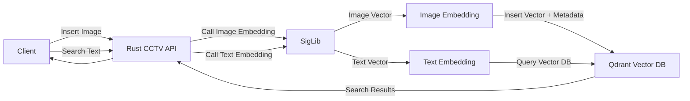
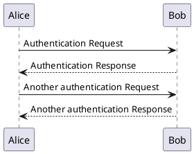

## Prerequisites

- Rust 1.91+
- Docker and Docker Compose
- Qdrant vector database
- AI service for embeddings (Python)

## Environment Variables

The application can be configured using the following environment variables:

| Variable | Default | Description |
|----------|---------|-------------|
| `QDRANT_URL` | `http://localhost:6334` | URL of the Qdrant vector database |
| `AI_SERVICE_URL` | `http://localhost:5090` | URL of the AI service for generating embeddings |
| `COLLECTION_NAME` | `ntcctvvehicles` | Name of the Qdrant collection to use |
| `QDRANT_API_KEY` | `your_api_key_here` | API key for Qdrant (if required) |

## Installation and Setup

### Local Development

1. Clone the repository:
   ```bash
   git clone <repository-url>
   cd rust-cctv
   ```

2. Copy the example environment file:
   ```bash
   cp .env.example .env
   ```

3. Update the `.env` file with your specific configuration

4. Install dependencies and run:
   ```bash
   cargo build
   cargo run
   ```

### Docker Deployment

1. Build and run with Docker Compose:
   ```bash
   docker-compose up -d
   ```

2. The service will be available at `http://localhost:8080`

## API Endpoints

### Search for CCTV Footage

Search for CCTV footage using natural language queries.

**Endpoint:** `POST /search`

**Request Body:**
```json
{
  "query": "red car speeding down highway",
  "top_k": 5
}
```

**Parameters:**
- `query` (string, required): Natural language search query
- `top_k` (integer, optional): Number of results to return (default: 5)

**Response:**
```json
[
  {
    "filename": "video_123.mp4",
    "caption": "Red sedan passing intersection at high speed",
    "score": 0.87
  },
  {
    "filename": "image_456.jpg",
    "caption": "Red vehicle on highway",
    "score": 0.82
  }
]
```

### Insert Image with Embedding

Add a new image to the vector database for future searches.

**Endpoint:** `POST /insert_image`

**Request Body:**
```json
{
  "image": "https://example.com/path/to/image.jpg"
}
```

**Parameters:**
- `image` (string, required): URL or path to the image

**Response:**
```json
{
  "status": "ok",
  "point_id": 123456789,
  "type": "image_embedding",
  "embedding": [0.12, -0.34, 0.56, ...]
}
```

## Implementation Details

### Project Structure

```
src/
├── main.rs          # Application entry point and server configuration
├── handlers.rs      # HTTP request handlers
├── models/          # Data models and structs
│   └── search.rs    # Models for search requests/responses
└── services.rs      # Business logic and external service calls
```

### How It Works

1. **Search Flow:**
   - Client sends a natural language query to `/search`
   - The service calls the AI service to convert the text to a vector embedding
   - The vector is used to perform similarity search in Qdrant
   - Results are formatted and returned to the client

2. **Image Insertion Flow:**
   - Client sends an image URL to `/insert_image`
   - The service calls the AI service to generate an image embedding
   - The embedding and metadata are stored in Qdrant
   - A point ID and status are returned to the client

## Dependencies

- [actix-web](https://docs.rs/actix-web/) - Web framework for Rust
- [serde](https://docs.rs/serde/) - Serialization/deserialization
- [reqwest](https://docs.rs/reqwest/) - HTTP client
- [qdrant-client](https://docs.rs/qdrant-client/) - Qdrant database client
- [tokio](https://docs.rs/tokio/) - Asynchronous runtime
- [dotenv](https://docs.rs/dotenv/) - Environment variable loading
