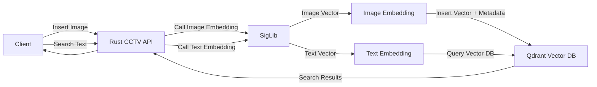

# Rust CCTV Search Backend

A high-performance backend service for searching CCTV footage using vector embeddings and Qdrant vector database.

## Features

- **Image Search**: Search for CCTV images using natural language queries
- **Datetime Filtering**: Filter search results by date and time ranges
- **URL Support**: Works with both local filenames and image URLs
- **Filename Parsing**: Automatically extracts metadata from CCTV filenames
- **Automated Image Fetching**: Background scheduler that automatically fetches and indexes images from CCTV metadata API every 10 minutes

## Software Architecture


## Supported Filename Formats

- Underscore format: `cctv08_2025-10-08_06-32_4.jpg`
- Dash format: `cctv08-2025-10-08-06-32-4.jpg`
- Full URLs: `https://i.postimg.cc/XNxQM7Z2/cctv08-2025-10-08-06-32-4.jpg`

## Project Structure

```
rust-cctv/
├── src/
│   ├── main.rs             # Application entry point
│   ├── handlers.rs         # HTTP request handlers
│   ├── services.rs         # Business logic and utilities
│   └── models/
│       ├── mod.rs
│       └── search.rs       # Data models
├── Cargo.toml
└── README.md
```

## Installation

1. Clone the repository
2. Install dependencies
   ```bash
   cargo build
   ```
3. Set up environment variables (see Configuration)
4. Run the service
   ```bash
   cargo run
   ```
   
   The application will automatically:
   - Create the collection if it doesn't exist
   - Set up a datetime field index for filtering

## Configuration

Configure the application using environment variables:

- `QDRANT_URL`: URL of the Qdrant vector database (default: `http://localhost:6334`)
- `AI_SERVICE_URL`: URL of the AI embedding service (default: `http://localhost:5090`)
- `COLLECTION_NAME`: Name of the Qdrant collection (default: `ntcctvvehicles`)
- `QDRANT_API_KEY`: API key for Qdrant (if required)
- `CCTV_API_URL`: URL of the CCTV metadata API (default: `https://ntvideo.totbb.net/video-metadata/train-data-condition`)
- `CCTV_AUTH_TOKEN`: Bearer token for CCTV metadata API authentication (required)
- `CCTV_ID`: CCTV camera ID to fetch images from (default: `cctv01`)

## Collection and Index Setup

The application automatically handles:
1. **Collection Creation**: Creates the collection with 768-dimensional vectors and cosine distance if it doesn't exist
2. **Datetime Index**: Creates a datetime field index to enable filtering by date and time ranges

If you're setting up manually, you would need to:
```bash
# Create index for datetime field
curl -X PUT "http://localhost:6334/collections/{collection_name}/index" \
  -H "Content-Type: application/json" \
  -d '{
    "field_name": "datetime",
    "field_schema": "datetime"
  }'
```

## Automated Image Fetching

The application includes a background scheduler that automatically fetches and indexes CCTV images from the metadata API. This feature runs independently from the web server.

### How It Works

1. **Scheduler**: Runs every 10 minutes (configurable via cron expression in `main.rs`)
2. **Fetch Limit**: Fetches up to 20 images per run
3. **Date Range**: Queries images from the last 2 days
4. **Processing**: For each fetched image:
   - Downloads the image metadata
   - Generates vector embeddings via the AI service
   - Parses the filename to extract datetime and camera information
   - Stores the embedding and metadata in Qdrant

### Logs

The scheduler provides detailed logging:
```
⏰ Running scheduled CCTV image fetch...
📡 Fetching CCTV training data from API...
   -> CCTV ID: cctv01
   -> Date Range: 2025-12-15 08:00:00 to 2025-12-17 20:00:00
   -> Limit: 20
✅ Successfully fetched 20 images from CCTV API
📥 Processing 20 images...
   [1/20] Processing: https://example.com/image1.jpg
      ✅ Inserted successfully
...
✅ Scheduled task completed
```

### Configuration

To configure the automated fetching, update these environment variables:
- `CCTV_API_URL`: The API endpoint
- `CCTV_AUTH_TOKEN`: Your Bearer authentication token
- `CCTV_ID`: The camera ID to fetch images from

The scheduler starts automatically when the application launches and runs in the background.

## API Endpoints

### Insert Image

Insert a new CCTV image with metadata.

**Endpoint**: `POST /insert_image`

**Request Body**:
```json
{
  "image": "https://i.postimg.cc/XNxQM7Z2/cctv08-2025-10-08-06-32-4.jpg"
}
```

**Response**:
```json
{
  "status": "ok",
  "point_id": 123456789,
  "type": "image_embedding",
  "embedding": [0.1, 0.2, 0.3, ...]
}
```

### Search Images

Search for images similar to a text query, optionally filtered by datetime range.

**Endpoint**: `POST /search`

**Request Body**:
```json
{
  "query": "red car speeding",
  "top_k": 5,
  "start_date": "2025-10-08T06:00:00Z",
  "end_date": "2025-10-08T07:00:00Z"
}
```

Or with empty datetime strings (no filtering):
```json
{
  "query": "red car speeding",
  "top_k": 5,
  "start_date": "",
  "end_date": ""
}
```

**Parameters**:
- `query`: Text description of what you're looking for
- `top_k`: Number of results to return (optional, default: 5)
- `start_date`: Start of datetime range in RFC 3339 format (optional, can be empty string)
- `end_date`: End of datetime range in RFC 3339 format (optional, can be empty string)

**Response**:
```json
[
  {
    "filename": "cctv08-2025-10-08-06-32-4.jpg",
    "caption": "red car speeding",
    "score": 0.89,
    "datetime": "2025-10-08T06:32:00Z"
  },
  ...
]
```

## Datetime Filtering

The search endpoint supports filtering by datetime range using RFC 3339 format:

- `2025-10-08T06:32:00Z` (RFC 3339, UTC)
- `2025-10-08T06:32:00` (without timezone, UTC assumed)
- `2025-10-08T06:32` (without timezone and seconds)
- `2025-10-08` (date only, midnight assumed)

## Dependencies

- actix-web: HTTP server framework
- qdrant-client: Vector database client
- reqwest: HTTP client
- chrono: Datetime handling
- serde: Serialization/deserialization

## Example Usage

1. Start the server:
   ```bash
   cargo run
   ```

2. Insert an image:
   ```bash
   curl -X POST http://localhost:8080/insert_image \
     -H "Content-Type: application/json" \
     -d '{"image": "https://i.postimg.cc/XNxQM7Z2/cctv08-2025-10-08-06-32-4.jpg"}'
   ```

3. Search for images:
   ```bash
   curl -X POST http://localhost:8080/search \
     -H "Content-Type: application/json" \
     -d '{
       "query": "red car",
       "start_date": "2025-10-08T06:00:00Z",
       "end_date": "2025-10-08T07:00:00Z"
     }'
   ```

## License

This project is licensed under the MIT License.
